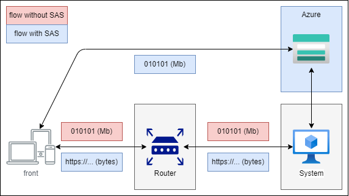

# Introdution

Code snippet for create URLs with Shared Access Signature (SAS) for Azure Storage Account blob file.

# Architecture

To avoid hight traffic on downloading/uploading files from/to a storage account, SAS token can be used to temporary gives permissions to users or systems to specific file.

Then, instead of all kilobytes or megabytes fill paths between user and machine where the main system is hosted, it's possible to make requests directly to Azure Storage Account.

Draw bellow ilustrates the flow with (blue) and without (red) SAS token.



# Steps

1. Canonicalize of blob file, in format `/blob/account/container/file`;
2. Generate signature with parameters
3. Encode url parameters with encoded signature;
4. Concat mounted url for file with url parameters.

# Signature

To create SAS signature and mount URL, follow bellow steps.

- Mount a string to create signature with the format bellow.

```ini
signedPermissions\n
signedStart\n
signedExpiry\n
canonicalizedResource\n
signedIdentifier\n
signedIP\n
signedProtocol\n
signedVersion\n
signedResource\n
signedSnapshotTime\n
signedEncryptionScope\n
rscc\n
rscd\n
rsce\n
rscl\n
rsct
```

- With this string and account key, generate signature, decoding account key, creating a HMAC-SHA256 sign and codifying it to base64.

- With signature and parameters, mount query parameters with the format bellow.

```ini
sv=signedVersion
&spr=signedProtocol
&sp=signedPermissions
&se=signedExpiry
&sr=signedResource
&sig=signature # Url encoded signature generated
```

# Run

For php, build image with `Dockerfile-php`.

```bash
# Build image using file Dockerfile-php
docker build --rm -f Dockerfile-php -t storage-tmp-url .
```

For js, build image with `Dockerfile-js`.

```bash
# Build image using file Dockerfile-php
docker build --rm -f Dockerfile-js -t storage-tmp-url .
```

Then, run with command:

```bash
# Run image and remove container after run
docker run --rm storage-tmp-url
```

# References

[Create service SAS][create-service-sas]

<!-- References -->

[create-service-sas]: https://learn.microsoft.com/en-us/rest/api/storageservices/create-service-sas
